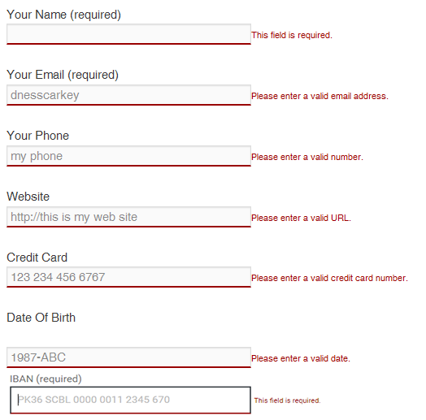
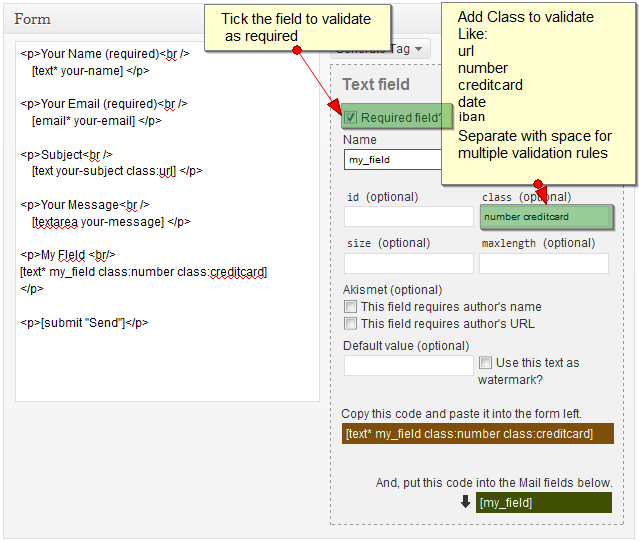
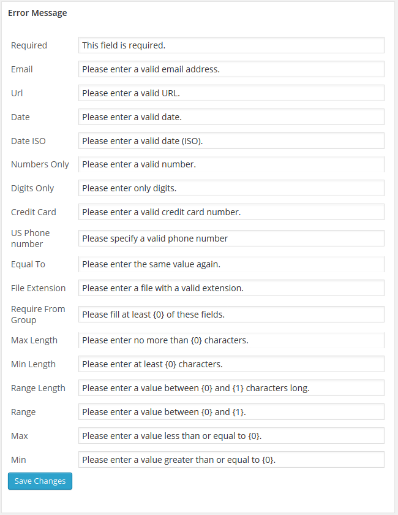
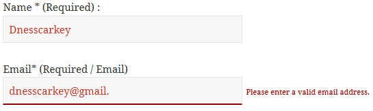
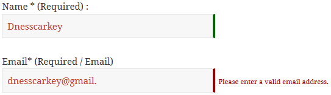
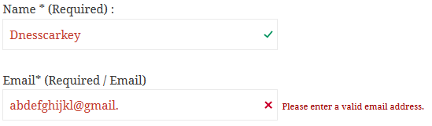
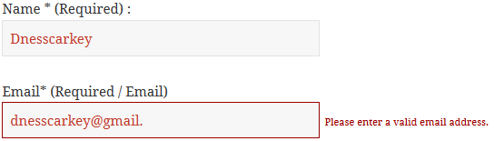
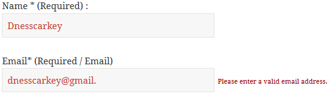

# Jquery Validation For Contact Form 7 
Contributors: dnesscarkey 
Tags: contact form 7 js validation, jquery validation, contact form 7 jquery validation, form validation, contact form 7 us phone number validation, contact form 7 iban number validation, file extension validation, url validation, credit card validaton, minlength validation, range validation 
Requires at least: 3.0 
Tested up to: 4.3.1 
Stable tag: 3.1 

New standard of validation for Contact Form 7 plugin.

## Description
This plugin adds jquery validation to your contact form 7. You will be able to validate extra validation rules like: url, date, credit card, phone number in the contact form 7 fields.

Benefits you get from this plugins.

* Adds Jquery Validation to Contact Form Fields.
* More faster validation than of contact form core validation.
* Allows field to be validated for url, date, credit card, number and more.
* Field Highlight features for invalid field data types.
* Error message for individual fields.
* Easy to to add validation rules. Just add class in contact form 8 fields.
* Interactive validation that your users love.
* Works with multiple forms now.

Validation Methods available.

* Required
* Email
* Url
* Date
* Number
* Digit only
* Credit Card
* US Phone number
* IBAN

[Lite Version Demo](http://dnesscarkey.com/jquery-validation/lite-version-demo/)

Additional Validation Methods available in PRO version.

* Minimum Number - Makes the element require a given minimum.
* Maximum Number - Makes the element require a given maximum.
* Minimum Length - Makes the element require a given minimum length.
* Maximum Length - Makes the element require a given maximum length.
* Range Length - Makes the element require a given value range.
* Range - Makes the element require a given value range.
* Equal To - Requires the element to be the same as another one
* Extension - Makes the element require a certain file extension
* Require Group - Ensures a given number of fields in a group are complete.

Additional Features in Pro version.

* 4 different [validation error theme](http://dnesscarkey.com/jquery-validation/validation-error-theme/) to choose from.
* Change [validation error message](http://dnesscarkey.com/jquery-validation/change-error-message/).

[Pro Version Demo](http://dnesscarkey.com/jquery-validation/pro-version-demo/)

For Support Please Visit [http://dineshkarki.com.np/forums/forum/jquery-validation-for-contact-form](http://dineshkarki.com.np/forums/forum/jquery-validation-for-contact-form). We don't respond to tickets created here.

Don't forget to check the instructions in the setting page of the plugin.

## Installation

1. Upload the plugin jquery-validation-for-contact-form-7 files to the `/wp-content/plugins/` directory
1. Activate the jquery-validation-for-contact-form-7 plugin through the 'Plugins' menu in WordPress.
1. Select Jquery Validation For Contact Form 7 under Settings
1. Don't forget to check the instructions in the setting page of the plugin.

## Frequently Asked Questions

= Does it works with multiple contact form ? =

Yes, this plugin has been take care to handle multiple forms in a single page.

## Screenshots

1. Contact Form With extra jquery validation in front end. 

1. Setting and Instruction For Jquery Validation For Contact Form 7. 

1. Change Error Message 

1. Validation Error Theme 1 (Lite Version) 

1. Validation Error Theme 2 (Only Available in Pro Version) 

1. Validation Error Theme 3 (Only Available in Pro Version) 

1. Validation Error Theme 4 (Only Available in Pro Version) 

1. Validation Error None (Lite Version) 

## Changelog

= 3.1.1 =

* Added support for IBAN validation.

= 3.1 =

* Fixed Contact Form 7 loading icon issue.

= 3.0.2 =

* Tested with WP 4.2.3 and Contact Form 7 Ver 4.2.1.
* Latest jquery validation plugin

= 3.0.1 =

* Tested with WP 4.1.1 and Contact Form 7 Ver 4.1.1.
* Added more validation rules.
* Fixed PhoneUS validation.

= 2.0 =

* Tested with 3.9

= 1.1 =

* Multiple form issues fixed.

= 0.3 =

* IE issues fixed.

= 0.2 =

* Error Fixes

= 0.1 =

* First Release
